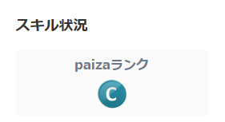

    

 
    <h2 style="border-bottom: 1px solid #21262d; color: #c9d1d9;"> Hi, there🖐️ </h2>  
    
 <li> 열심히 하고싶은 나 
 

 
    <h2 style="border-bottom: 1px solid #21262d; color: #c9d1d9;"> 🏅 Stats </h2> 
    <table align="center" style="border-collapse: collapse; border: none;">
        <tr>
            <td align="center" valign="middle" style="border: none; padding: 10px;">
                
            </td>
            <td align="center" valign="middle" style="border: none; padding: 10px;">
                
                 
                
My Paiza Rank

            </td>
        </tr>
    </table>
    

 

