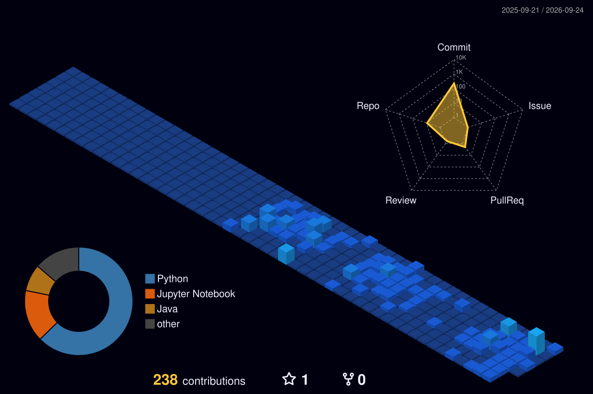

  <!-- Header Banner -->
  

  # Hi, there 👋

  **열심히 성장하고 싶은 개발자 강민우입니다.**

   

  <!-- Tech Stack -->
  <h3>🛠 Tech Stack</h3>
  

    
    
    
  

   

   

  <!-- 연속 잔디 통계 -->

  <h3 style="color: #ffffff;">🔥 Current Streak</h3>
   
  

  

